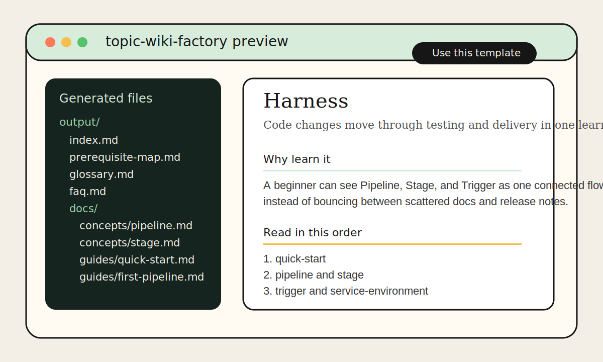

# Topic Wiki Factory

[English](README.en.md)

어떤 주제든 파인만 구조로 정리된 학습형 위키를 30분 안에 만들 수 있게 돕는 AI 에이전트 템플릿이다.

> "이게 뭔지" -> "왜 필요한지" -> "뭘 먼저 알아야 하는지" -> "어떻게 쓰는지"
> 순서로, 처음 보는 사람도 따라갈 수 있는 위키를 만든다.

예시:
- `Harness` -> Harness CI/CD 위키
- `체스` -> 체스 학습 위키
- `n8n` -> n8n 자동화 위키



## 예시 보기

실제 결과물이 어떤 식으로 생기는지 먼저 보고 싶다면 [examples/README.md](examples/README.md)를 보면 된다.
지금은 `examples/chess-intro/` 하나를 넣어 두었고, 입력 설정부터 생성 결과까지 같이 볼 수 있다.

## 시작하기

### 방법 1. GitHub 템플릿으로 시작

1. GitHub에서 `Use this template`를 눌러 새 저장소를 만든다.
2. 새 저장소를 로컬에 클론한다.
3. Claude Code 또는 원하는 AI 런타임에서 아래 흐름을 실행한다.

### 방법 2. 직접 클론

```bash
git clone https://github.com/techtaek77/topic-wiki-factory my-wiki
cd my-wiki
```

### 1. 초기화

Claude Code 사용 시:

```text
@wiki-initializer
```

Cursor / Codex / 기타 사용 시:
- `prompts/wiki-initializer.md`를 열어 그대로 붙여넣는다.

initializer는 주제 정의, 제외 범위, 참고할 로컬 자료, 출력 경로를 순서대로 묻고 `wiki-config.yaml`과 `wiki-state.json`을 초기화한다.

### 2. 위키 생성

```text
@wiki-orchestrator
```

orchestrator는 `wiki-state.json`을 읽고 다음 작업을 정한다.
중간에 멈췄다가 다시 실행해도 이미 끝난 문서는 다시 쓰지 않는다.
`hitl.confirm_scope_after_research`, `hitl.confirm_ia_before_writing` 둘 다 `false`면 사람 확인 단계 없이 다음 phase로 자동 진행한다.
다만 기본 실행 모델은 병렬 writer가 아니라, 문서 1개씩 고르는 순차 자동 진행이다.

수동으로 돌릴 때의 기본 순서는 아래와 같다.

1. `wiki-initializer`
2. `wiki-researcher`
3. `wiki-orchestrator` -> scope 확인
4. `wiki-orchestrator` -> IA 확인
5. `wiki-writer {slug}` 반복
6. `wiki-reviewer`

### 3. 완료 후 발행

`wiki-config.yaml`에서 `publish.enabled: true`로 바꾼 뒤:

```text
@wiki-publish-preflight
@wiki-publisher
```

`wiki-publish-preflight`는 `repo_url` 누락, `.wiki.git` 대상의 `Home.md` 필요 여부, 내부 파일 ignore 규칙까지 먼저 점검한다.

## 같은 이름, 다른 의미 처리

`Harness`처럼 같은 이름이 제품명일 수도 있고 일반 개념일 수도 있는 주제는 두 번 확인한다.

1. researcher가 해석 후보를 비교한다.
2. orchestrator가 research 이후 범위를 사람에게 다시 확인받는다.
3. 글쓰기 전에 IA를 한 번 더 확인한다.

덕분에 "말은 하네스인데 갑자기 CI/CD 문서가 튀어나오는 사고"를 줄일 수 있다.

## 폴더 구조

```text
/
├── .claude/agents/       <- Claude Code 에이전트
├── assets/               <- README용 정적 자산
├── examples/             <- 보여주기용 샘플 위키
├── prompts/              <- 타 런타임용 프롬프트
├── templates/            <- 문서 템플릿과 스키마 예시
├── CONTRIBUTING.md
├── LICENSE
├── CODE_OF_CONDUCT.md
├── README.md
├── plan.md
├── spec.md
├── wiki-config.yaml
└── wiki-state.json
```

루트의 `wiki-config.yaml`과 `wiki-state.json`은 의도적으로 빈 시작 상태로 들어 있다.
샘플 위키 산출물은 공개 저장소에 포함하지 않으며, 실제 문서와 `docs/`, `sources.md`, `wiki-memory.md`는 첫 실행 뒤 `output_path` 아래 생성된다.

```yaml
output_path: "./output/harness"        # 독립 폴더
output_path: "03.Resources/하네스"     # Obsidian 볼트 안
output_path: "../my-chess-wiki/docs"   # 다른 repo
```

## 에이전트 목록

| 에이전트 | 역할 | 실행 시점 |
|---------|------|---------|
| `wiki-initializer` | 설정 마법사 | 최초 1회 |
| `wiki-orchestrator` | 진행 관리 | 단계마다 반복 |
| `wiki-researcher` | 소스 수집 | orchestrator가 호출 |
| `wiki-writer` | 문서 작성 | orchestrator가 호출 |
| `wiki-reviewer` | 품질 검토 | orchestrator가 호출 |
| `wiki-publish-preflight` | 배포 전 점검 | 발행 직전 |
| `wiki-publisher` | GitHub 발행 | 완료 후 1회 |
| `wiki-updater` | 변경 파급 분석 | 내용 수정 시 |
| `wiki-auditor` | 구조 점검 | 주기적으로 |
| `wiki-freshness` | 최신성 점검 | tool 위키만 |
| `wiki-gap-finder` | 빈 구간 탐지 | 주기적으로 |

## 런타임별 실행법

| 런타임 | 실행 방법 |
|--------|---------|
| Claude Code | `@wiki-initializer` -> `@wiki-orchestrator` 반복 |
| Cursor | `prompts/wiki-*.md`를 `.cursor/rules/`에 맞게 옮겨 사용 |
| Codex / GPT | `prompts/wiki-*.md`를 열고 AI에 붙여넣기 |

## Known Limitations

- 사실 검증을 완전 자동으로 끝내 주지는 않는다. 최종 검수는 사람이 해야 한다.
- 첫 버전은 GitHub Markdown 기준으로 설계돼 있다.
- 모든 주제에서 완벽한 IA를 자동 보장하지 않는다.
- 다국어 번역, CMS, 협업 권한 관리까지는 아직 범위 밖이다.
- 지식형 주제는 공식 소스가 약할 수 있어 research 품질 차이가 더 크다.

## 기여

기여 전에 [CONTRIBUTING.md](CONTRIBUTING.md)를 먼저 보면 편하다.
프롬프트를 바꿀 때는 `.claude/agents/`와 `prompts/`를 같이 맞춰 주는 게 핵심이다.

## 참고

- `templates/` -> 문서 구조 예시와 스키마 상세
- `spec.md` -> 설계 문서
- `parallel-writer-spec.md` -> 병렬 writer 확장 설계
- `tests/README.md` -> orchestrator acceptance harness 설명
- `plan.md` -> 개발 계획
