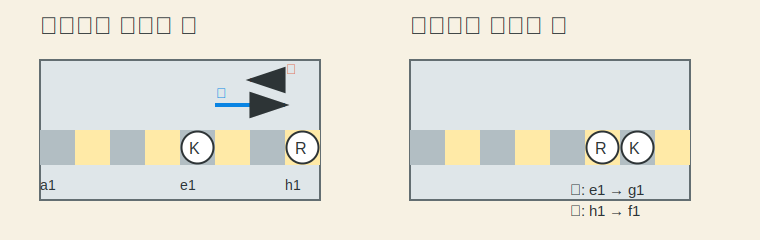

# 캐슬링 (Castle)

> 킹과 룩을 한 번에 움직여 킹을 숨기고 룩을 꺼내는 특수 규칙이다.

---

## 왜 필요한가

초보자는 캐슬링을 "킹이 갑자기 두 칸 가네?" 정도로만 보고 지나가는데, 사실 이 수는 킹 안전과 룩 전개를 동시에 해결한다.
그래서 초반에 가장 먼저 익혀 둘 가치가 있는 특수 규칙이다.

- 없으면: 킹이 중앙에 오래 남아 맞기 쉽다
- 있으면: 킹을 안전하게 숨기면서 룩도 자연스럽게 게임에 나온다
- 비유: 킹을 대피시키면서 룩한테 출근 문도 같이 열어 주는 느낌이다

---

## 먼저 알아야 할 것

| 개념 | 한 줄 설명 | 링크 |
|------|-----------|------|
| Chess Basics | 체스 목표와 기본 규칙을 먼저 잡는 입문 문서다. | [chess-basics](../guides/chess-basics.md) |
| Check | 왕이 공격받는 상태에서는 특별 규칙도 마음대로 못 쓴다. | [Check](../../glossary.md#check) |

---

## 어떻게 적용하는가

캐슬링은 킹이 두 칸 움직이고, 룩이 킹 옆 칸으로 넘어오는 방식으로 이뤄진다.
킹사이드 캐슬링이 초보자가 가장 자주 보는 형태라서 먼저 그 그림으로 익히면 편하다.

위 그림처럼 `e1`의 킹이 `g1`으로, `h1`의 룩이 `f1`으로 오면 킹사이드 캐슬링이다.

### 예시

백 기준으로 나이트와 비숍이 빠져서 `f1`, `g1` 칸이 비었다고 해보자.
그리고 킹과 오른쪽 룩이 아직 안 움직였고, 킹이 체크도 아니라면 `O-O`로 캐슬링할 수 있다.

### 핵심 포인트

- 킹과 해당 룩이 한 번도 안 움직였어야 한다.
- 킹과 룩 사이 칸이 비어 있어야 한다.
- 킹은 체크 상태에서 캐슬링할 수 없다.
- 킹이 지나가는 칸과 도착 칸도 공격받고 있으면 안 된다.

### 자주 하는 실수

- 체크를 피하려고 캐슬링부터 누름 -> 체크 상태에서는 캐슬링할 수 없다.
- 사이에 기물이 있는데 하려고 함 -> 킹과 룩 사이 칸이 비어 있어야 한다.
- 룩만 안 움직였으면 되는 줄 앎 -> 킹도 안 움직였어야 한다.

---

## 더 깊이 가려면

| 문서 | 이유 |
|------|------|
| [quick-start](../guides/quick-start.md) | 실제 초반 전개에서 캐슬링 준비 흐름을 같이 본다. |
| [en-passant](en-passant.md) | 캐슬링 다음으로 많이 헷갈리는 특수 규칙을 이어서 본다. |
| [faq](../../faq.md) | 체크와 특수 규칙 관련 초보 질문을 짧게 정리했다. |

---

*관련 용어: [Castle](../../glossary.md#castle) · [Check](../../glossary.md#check) · [Development](../../glossary.md#development)*
