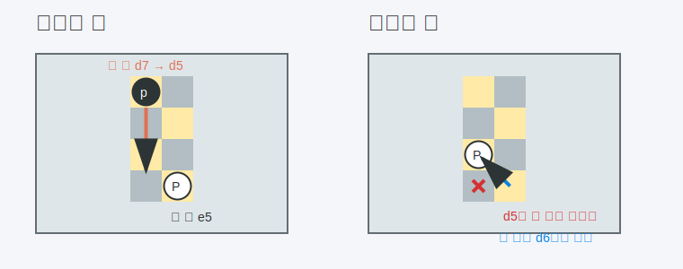

# 앙파상 (En Passant)

> 상대 폰이 두 칸 전진한 직후에만 가능한, 폰 전용 예외 잡기 규칙이다.

---

## 왜 필요한가

앙파상은 초보자가 가장 자주 "이건 버그 같은데?" 하고 멈추는 규칙이다.
문장으로만 읽으면 더 헷갈리니, 전후 상태를 그림으로 먼저 보는 게 훨씬 빠르다.

- 없으면: 누가 왜 갑자기 옆 폰을 잡았는지 이해가 안 간다
- 있으면: 폰 규칙의 예외를 한 번에 정리할 수 있다
- 비유: 체스 규칙이 갑자기 숨겨 둔 단서 하나를 꺼내는 느낌이다

---

## 먼저 알아야 할 것

| 개념 | 한 줄 설명 | 링크 |
|------|-----------|------|
| Chess Basics | 폰이 평소엔 어떻게 움직이고 잡는지 먼저 알아야 한다. | [chess-basics](../guides/chess-basics.md) |
| Pawn | 앞으로 가고 대각선으로 잡는 가장 예외 많은 기물이다. | [Pawn](../../glossary.md#pawn) |

---

## 어떻게 적용하는가

앙파상은 상대 폰이 시작 자리에서 두 칸 전진해 내 폰 옆칸에 딱 붙었을 때만 가능하다.
그 즉시 다음 수에만 잡을 수 있고, 한 턴 지나면 기회가 사라진다.

그림처럼 흑 폰이 `d7`에서 `d5`로 두 칸 내려온 직후, 백 폰은 `e5`에서 `d6`으로 가며 그 폰을 잡는다.
잡힌 폰은 `d5`에 있었더라도 사라지고, 백 폰은 `d6`에 서게 된다.

### 예시

백 폰이 `e5`에 있고, 흑이 `d7` 폰을 `d5`로 두 칸 전진했다고 해보자.
이때 바로 다음 수에만 백은 `exd6 e.p.`처럼 앙파상으로 잡을 수 있다.

### 핵심 포인트

- 상대 폰이 두 칸 전진한 "직후"에만 가능하다.
- 잡는 폰은 대각선 앞으로 이동한다.
- 결과적으로 잡힌 폰은 옆칸에서 사라진다.
- 한 턴 지나면 다시는 그 앙파상 기회를 쓸 수 없다.

### 자주 하는 실수

- 나중에도 되는 줄 앎 -> 바로 다음 수에만 가능하다.
- 내 폰이 옆칸에 없어도 되는 줄 앎 -> 앙파상 할 폰이 바로 옆 파일에 있어야 한다.
- 폰이 도착한 칸의 말을 잡는다고 착각함 -> 실제론 지나간 것으로 간주하고 잡는다.

---

## 더 깊이 가려면

| 문서 | 이유 |
|------|------|
| [promotion](promotion.md) | 폰 관련 예외 규칙을 이어서 보면 머리에 덜 꼬인다. |
| [faq](../../faq.md) | 초보자가 가장 많이 멈추는 질문을 짧게 다시 확인한다. |
| [sources](../../sources.md) | 인터랙티브 사이트에서 직접 움직여 보면 더 빨리 익는다. |

---

*관련 용어: [En Passant](../../glossary.md#en-passant) · [Pawn](../../glossary.md#pawn) · [File](../../glossary.md#file)*
