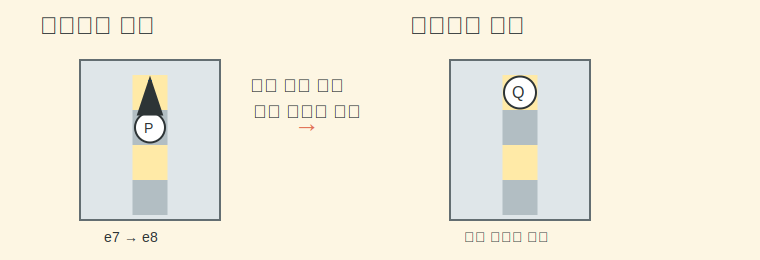

# 프로모션 (Promotion)

> 가장 약해 보이던 폰이 끝까지 살아남았을 때, 완전히 다른 기물로 바뀌는 규칙이다.

---

## 왜 필요한가

프로모션은 체스에서 제일 영화 같은 순간 중 하나다.
한동안 묵묵히 한 칸씩 기어가던 폰이 마지막 줄에 도착하더니, 갑자기 퀸으로 바뀌며 판 분위기를 뒤집는다.

그래서 프로모션은 단순 규칙이 아니라 감각을 바꿔 준다.
"폰은 소모품"처럼 보이던 생각이 "끝까지 가면 영웅이 될 수도 있네"로 바뀐다.

- 없으면: 폰이 끝까지 가도 뭐가 일어나는지 몰라 멈춘다
- 있으면: 엔드게임에서 폰의 가치가 왜 큰지 이해된다
- 비유: 레벨 1 캐릭터가 끝까지 살아남아서 클래스 변경하는 느낌이다

---

## 먼저 알아야 할 것

| 개념 | 한 줄 설명 | 링크 |
|------|-----------|------|
| Chess Basics | 폰과 승리 조건의 큰 그림을 먼저 알아야 한다. | [chess-basics](../guides/chess-basics.md) |
| Pawn | 평범해 보여도 끝줄에 닿으면 완전히 다른 역할을 할 수 있다. | [Pawn](../../glossary.md#pawn) |

---

## 어떻게 적용하는가

폰이 상대 진영의 마지막 줄에 도착하면 퀸, 룩, 비숍, 나이트 중 하나로 바꿀 수 있다.
초보 단계에서는 대부분 퀸으로 승격하는 경우가 많아서 먼저 그렇게 익혀도 괜찮다.

그림처럼 백 폰이 `e7`에서 `e8`에 도착하면, 보통 새 퀸으로 바꿔 바로 강한 압박을 만든다.

### 예시

백 폰이 `e7`에 있고 다음 수에 `e8`로 전진할 수 있다고 해보자.
이때 `e8=Q`처럼 적으며 퀸으로 프로모션하면, 약한 폰이 바로 강한 장거리 기물로 바뀐다.

### 핵심 포인트

- 프로모션은 퀸만 가능한 게 아니다.
- 룩, 비숍, 나이트로도 승격할 수 있다.
- 하지만 초보 단계에서는 퀸 프로모션을 가장 먼저 익히면 된다.
- 프로모션 순간 체크나 체크메이트가 바로 생길 수도 있다.

외울 때는 이렇게 잡으면 편하다.
`폰은 약해서 무시하는 말이 아니라, 끝까지 가면 판을 갈아엎는 말이다.`

### 자주 하는 실수

- 무조건 퀸만 되는 줄 앎 -> 다른 기물로도 승격할 수 있다.
- 끝줄에 도착한 뒤 다음 턴에 바꾸는 줄 앎 -> 도착하는 그 순간 바로 바뀐다.
- 폰을 그냥 놔두면 되는 줄 앎 -> 프로모션은 선택이 아니라 즉시 처리다.

---

## 더 깊이 가려면

| 문서 | 이유 |
|------|------|
| [en-passant](en-passant.md) | 폰이 가진 또 다른 대표 예외 규칙을 함께 정리한다. |
| [faq](../../faq.md) | 프로모션과 무승부 쪽 헷갈림을 다시 확인한다. |
| [sources](../../sources.md) | 연습 사이트에서 엔드게임 감각을 붙이기 좋다. |

프로모션까지 이해하면 체스가 조금 다르게 보인다.
앞부분은 배치 게임 같았는데, 뒤로 갈수록 "누가 끝까지 살아남느냐"의 이야기도 된다는 걸 느끼게 된다.

---

*관련 용어: [Promotion](../../glossary.md#promotion) · [Pawn](../../glossary.md#pawn) · [Queen](../../glossary.md#queen)*
