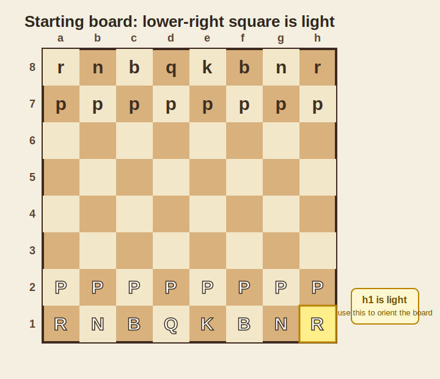

# 첫 판 들어가기

> 체스판을 놓고 가장 기본적인 시작 흐름을 한 판 안에서 따라가는 가이드다.

---

## 왜 필요한가

초보자는 규칙을 문장으로만 읽으면 금방 섞인다.
반대로 한 번이라도 말을 놓고 직접 움직여 보면 용어와 규칙이 훨씬 빨리 머리에 붙는다.

- 없으면: 기물 이름은 알지만 실제 판에서 어디에 두는지 헷갈린다
- 있으면: 좌표, 턴 진행, 체크 개념을 한 번에 익힐 수 있다
- 비유: 수영 책만 읽는 것보다 물에 발부터 담가보는 느낌이다

---

## 먼저 알아야 할 것

| 개념 | 한 줄 설명 | 링크 |
|------|-----------|------|
| Chess Basics | 게임 목표, 말 움직임, 체크메이트를 먼저 잡는 입문 문서다. | [chess-basics](chess-basics.md) |
| Rook | 직선 이동이 분명해서 체스판 감각을 익히기 좋은 기물이다. | [rook](../concepts/rook.md) |
| Check | 왕이 위협받을 때 반드시 대응해야 하는 상태다. | [Check](../../glossary.md#check) |

---

## 어떻게 적용하는가

아래 순서만 따라 해도 체스판을 읽는 기본 감각이 생긴다.

위 그림처럼 오른쪽 아래 칸이 밝은색이 되게 놓고 시작하면 말 배치 설명이 덜 꼬인다.

### 시작 전에 30초만 체크

- 백이 먼저 둔다.
- 폰은 두 번째 줄에 놓는다.
- 룩은 양 끝, 나이트는 그 안쪽, 비숍은 그 안쪽이다.
- 퀸은 자기 색 칸에 놓는다.
- 킹은 남은 한 칸에 놓는다.

### 예시

1. 흰색 칸이 오른쪽 아래에 오도록 판을 놓는다.
2. 두 번째 줄에 폰을 모두 둔다.
3. 첫 줄 양 끝에 룩, 그 옆에 나이트, 그 옆에 비숍을 둔다.
4. 퀸은 자기 색 칸에, 킹은 남은 칸에 둔다.
5. 백이 먼저 중앙 쪽으로 폰이나 나이트를 움직여 본다.
6. 상대 왕을 바로 잡을 수 있는 위협이 생기면 "체크"를 확인한다.
7. 체크를 당했다면 반드시 피하거나 막거나 잡아야 한다.

### 첫 5수는 이렇게만 해도 된다

이 문서는 오프닝 이론 수업이 아니라 "아, 게임이 이렇게 흐르는구나"를 익히는 데 목적이 있다.
그래서 아래처럼 아주 무난한 흐름만 따라 해도 충분하다.

1. 백: `e4` 같은 중앙 폰 전진
2. 흑: `e5`처럼 중앙 대응
3. 백: 나이트 전개
4. 흑: 나이트 전개
5. 양쪽 모두 비숍이나 다른 기물을 꺼내며 캐슬링 준비

중앙에 말을 조금씩 꺼내고, 킹을 안전하게 숨기는 방향으로 가면 초반 대참사는 꽤 줄어든다.

### 핵심 포인트

- 백이 먼저 시작한다.
- 기물 배치가 맞아야 이후 설명이 안 꼬인다.
- 첫 판에서는 이기는 것보다 말을 제대로 움직이는 경험이 더 중요하다.
- 퀸만 먼저 튀어나가면 멋있어 보여도 대개 맞고 돌아온다.
- 초반에는 중앙 칸 `d4`, `e4`, `d5`, `e5` 근처 감각을 익히면 좋다.

### 자주 하는 실수

- 판 방향을 거꾸로 둠 -> 오른쪽 아래 칸이 밝은색인지 먼저 확인한다.
- 체크를 당했는데 다른 수를 둠 -> 체크는 반드시 막거나 피해야 한다.
- 퀸을 먼저 너무 멀리 보냄 -> 강한 기물이지만 표적도 된다.
- 폰을 아무 생각 없이 많이 밀어버림 -> 뒤에 있는 기물 길이 꼬인다.

---

## 더 깊이 가려면

| 문서 | 이유 |
|------|------|
| [chess-basics](chess-basics.md) | 말 종류와 승리 조건을 먼저 이해하면 실제 배치가 더 쉬워진다. |
| [prerequisite-map](../../prerequisite-map.md) | 무엇을 먼저 익히면 덜 헤매는지 학습 순서를 정리한다. |
| [faq](../../faq.md) | 초반에 가장 많이 헷갈리는 질문을 짧게 해결한다. |

---

*관련 용어: [Check](../../glossary.md#check) · [Castle](../../glossary.md#castle) · [Central Control](../../glossary.md#central-control)*
