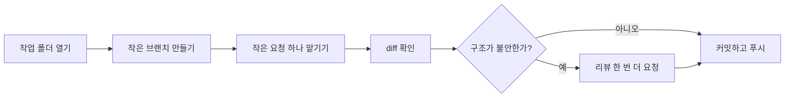

# 첫 작업 바로 해보기

> 첫 실행 때 괜히 큰 일부터 벌이지 않고, "작게 맡기고 확인하는 루프"를 한 번 성공하게 만드는 가장 짧은 Codex 안내서다.

---

## 왜 필요한가

처음 Codex를 켜면 은근히 욕심이 난다.
"이왕 켠 거 기능 하나 통째로 맡겨볼까?" 싶다.
근데 첫날에는 그 패턴이 오히려 실패 확률을 높인다.

처음엔 원리보다 순서가 중요하다.
한 번 직접 따라 해보면 "아, 이 정도 크기로 맡기면 되는구나"가 훨씬 빨리 온다.
첫 작업은 화려함보다 감 잡기가 이기는 판이다.

아래 흐름도는 그 첫 루프를 한 장으로 압축한 거다.
처음엔 문장보다 이 그림 하나가 더 빨리 들어올 수 있다.



---

## 먼저 알아야 할 것

| 개념 | 한 줄 설명 | 링크 |
|------|-----------|------|
| Agents and Context | 목표와 범위를 같이 줘야 덜 헤맨다. | [agents-and-context](../concepts/agents-and-context.md) |
| Review vs Implementation | 구현 요청과 리뷰 요청은 따로 쓰는 편이 좋다. | [review-vs-implementation](../concepts/review-vs-implementation.md) |

---

## 어떻게 적용하는가

### 1. 작업할 폴더를 연다

Codex는 지금 열린 폴더를 기준으로 본다.
그래서 먼저 수정할 저장소 폴더에 들어와 있어야 한다.

```bash
pwd
git status
```

### 2. 작은 브랜치를 만든다

main에서 바로 시작하지 말고 작업 단위별 브랜치를 먼저 만든다.
처음부터 안전장치를 걸어 두는 셈이다. 나중에 마음이 편하다.

```bash
git checkout -b codex/readme-tidy
```

### 3. 첫 요청은 아주 작게 넣는다

처음부터 큰 기능 전체를 맡기지 말고, README 한 문단이나 테스트 한 줄처럼 작은 작업으로 감을 잡는다.
처음 성공의 핵심은 "똑똑한 요청"보다 "작은 범위"다.

예시 요청:

```text
README 첫 문단을 더 명확하게 다듬어줘.
README.md만 수정하고 다른 파일은 건드리지 마.
수정 후에는 바뀐 내용을 diff 기준으로 설명해줘.
```

### 4. 결과는 diff부터 본다

수정이 끝났다고 바로 믿지 말고 무엇이 바뀌었는지 먼저 확인한다.
Codex를 잘 쓰는 사람은 결과 요약보다 diff를 먼저 본다. 여기가 진짜다.

```bash
git diff
```

### 5. 필요하면 리뷰를 한 번 더 건다

구조가 바뀌었거나 불안하면 구현 다음에 review를 따로 요청한다.
즉, "만드는 일"과 "의심하는 일"을 한 번에 시키지 않는 게 포인트다.

예시 요청:

```text
방금 변경을 리뷰해줘.
버그, 회귀 위험, 빠진 테스트 위주로 봐줘.
```

### 6. 괜찮으면 커밋하고 푸시한다

```bash
git add README.md
git commit -m "Clarify README intro"
git push -u origin codex/readme-tidy
```

### 핵심 포인트

- 시작은 항상 현재 폴더와 git 상태 확인부터
- 첫 작업은 작게
- 구현 후에는 diff 확인
- main 대신 feature branch

기억용 한 줄로 줄이면 이렇다.
`열기 -> 브랜치 -> 작은 요청 -> diff -> 필요하면 리뷰 -> 커밋`

### 자주 하는 실수

- 작업 폴더가 아닌 곳에서 시작함 -> `pwd`, `git status` 먼저 본다.
- 첫 요청이 너무 큼 -> 파일 1~2개 수준으로 줄인다.
- diff를 안 봄 -> 결과보다 변경 내용을 먼저 확인한다.
- 구현과 리뷰를 한 문장에 다 섞음 -> 먼저 만들고, 그다음 의심한다.

---

## 더 깊이 가려면

| 문서 | 이유 |
|------|------|
| [faq](../../faq.md) | 처음 쓰며 드는 현실적인 질문을 바로 해결한다. |
| [review-vs-implementation](../concepts/review-vs-implementation.md) | 언제 리뷰를 따로 요청할지 더 또렷하게 본다. |

---

*관련 용어: [Feature Branch](../../glossary.md#feature-branch) · [Harness](../../glossary.md#harness)*
