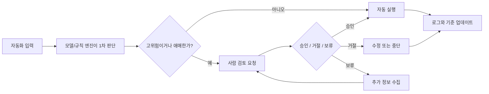

# HITL

> AI가 달리고 사람은 브레이크와 방향을 잡는 구조, 그 설계 감각을 빠르게 익히는 입문 위키다.

## HITL가 뭐냐면

HITL는 `Human-in-the-loop`의 줄임말이다.
AI나 자동화 시스템이 모든 결정을 혼자 내리게 두지 않고, 중요한 지점에서 사람이 검토하거나 승인하도록 넣는 방식이다.

핵심은 "사람이 다 한다"가 아니라 "기계가 빠르게 돌고, 사람은 사고 나기 쉬운 순간에 개입한다"에 있다.
즉 자동화와 수동 작업의 절충안이 아니라, 실패 비용이 큰 구간만 사람 판단으로 덮는 설계라고 보면 된다.

## 이 위키에 들어 있는 것

- HITL가 왜 필요한지
- 어디에 사람 확인을 넣어야 하는지
- 좋은 승인 요청이 갖춰야 할 정보
- 어디까지 자동화하고 어디서 멈춰야 하는지
- 설계하면서 자주 나오는 질문

## 5분 요약

1. HITL는 자동화를 포기하는 게 아니라, 위험 구간에만 사람 판단을 배치하는 방식이다.
2. 모든 단계에 승인 버튼을 넣으면 안전해지는 게 아니라 느려지고 책임도 흐려진다.
3. 좋은 체크포인트는 "틀리면 비싸다", "맥락이 애매하다", "정책 위반 가능성이 있다" 같은 지점에 생긴다.
4. 좋은 승인 요청은 근거, 선택지, 예상 결과를 같이 보여 준다.
5. 사람은 마지막 버튼만 누르는 장식이 아니라, 시스템 경계를 설계하는 주체다.

## 흐름 한 장 요약

## 처음이면 여기부터 보면 된다

- [hitl-basics](docs/guides/hitl-basics.md) - HITL가 왜 필요한지와 기본 구조를 먼저 본다.
- [checkpoint-design](docs/concepts/checkpoint-design.md) - 사람 확인을 어디에 넣어야 덜 답답하고 덜 위험한지 본다.
- [automation-boundary](docs/concepts/automation-boundary.md) - 어디까지 자동화하고 어디서 멈출지 경계를 잡는다.

## 이 위키를 보는 순서

1. [hitl-basics](docs/guides/hitl-basics.md)로 개념과 필요성을 잡는다.
2. [checkpoint-design](docs/concepts/checkpoint-design.md)로 승인 지점을 설계하는 기준을 본다.
3. [approval-ux](docs/concepts/approval-ux.md)로 좋은 승인 요청 화면과 메시지 원칙을 본다.
4. [automation-boundary](docs/concepts/automation-boundary.md)로 사람과 자동화의 경계를 정리한다.
5. [faq](faq.md), [glossary](glossary.md), [sources](sources.md)로 헷갈리는 부분을 메운다.

## 이런 상황이면 여기부터

- "그냥 승인 버튼 달면 되는 거 아냐?" 싶으면 [checkpoint-design](docs/concepts/checkpoint-design.md)부터 본다.
- "사람 확인 넣었더니 일만 느려졌다" 싶으면 [automation-boundary](docs/concepts/automation-boundary.md)를 본다.
- "승인 요청이 너무 불친절해서 사람도 못 고르겠다" 싶으면 [approval-ux](docs/concepts/approval-ux.md)를 본다.
- "용어부터 낯설다" 싶으면 [glossary](glossary.md)를 옆에 켜 둔다.
- "실전에서 뭘 참고해야 하지?" 싶으면 [sources](sources.md)로 간다.

## 자주 찾는 문서

- [checkpoint-design](docs/concepts/checkpoint-design.md) - 사람 확인 지점을 어디에 넣을지 판단 기준
- [approval-ux](docs/concepts/approval-ux.md) - 승인 요청 메시지와 화면 설계 원칙
- [automation-boundary](docs/concepts/automation-boundary.md) - 자동화와 사람 판단의 경계 잡기
- [faq](faq.md) - 설계할 때 자주 나오는 질문
- [glossary](glossary.md) - HITL, escalation, fallback 같은 용어 정리
- [questions](questions.md) - 아직 남아 있는 질문과 다음 보강 포인트
- [sources](sources.md) - 더 읽을 자료와 관찰 포인트

## 이 위키가 특히 좋은 사람

- AI 기능에 승인 단계를 넣어야 하는 PM
- 자동화 워크플로우를 설계하는 개발자
- "안전한 자동화"와 "답답한 수동 검토"의 차이를 이해하고 싶은 사람
